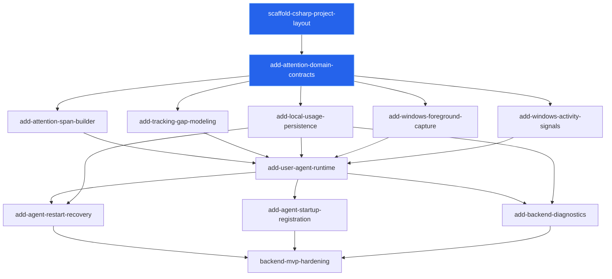

# User Agent MVP Incremental Changes

## Scope

This plan covers the backend-only user-agent MVP. It excludes the front-end UI round for timeline review, project categorization, user-facing controls, and visual editing.

The backend MVP should prove that the per-user agent can capture foreground app attention, construct spans and gaps, persist data locally, recover from interruptions, and provide enough diagnostics for verification.

## Change Sequence

### 1. `scaffold-csharp-project-layout`

Status: OpenSpec artifacts created.

Purpose:
- Create the cross-platform C# solution and test scaffold.
- Keep host-neutral projects separate from Windows-specific projects.
- Establish build/test entry points.

Depends on: none.

### 2. `add-attention-domain-contracts`

Status: OpenSpec artifacts created.

Purpose:
- Add host-neutral contracts for foreground observations, app identity, window context, attention spans, and tracking gaps.
- Preserve window titles as local domain context.
- Keep Windows API types out of the domain model.

Depends on:
- `scaffold-csharp-project-layout`

### 3. `add-attention-span-builder`

Purpose:
- Add host-neutral application logic that converts ordered `ForegroundObservation` values into completed `AttentionSpan` records.
- Handle app/window context changes.
- Avoid persistence, Windows APIs, and runtime sampling concerns.

Depends on:
- `add-attention-domain-contracts`

### 4. `add-tracking-gap-modeling`

Purpose:
- Add host-neutral rules for explicit `TrackingGap` creation.
- Represent stopped, crashed, system sleep, session locked, logged out, and unknown untracked time.
- Keep gap creation separate from Windows signal capture.

Depends on:
- `add-attention-domain-contracts`

### 5. `add-local-usage-persistence`

Purpose:
- Add the local usage sink boundary.
- Persist observations, attention spans, and tracking gaps locally.
- Keep storage strictly local with no network transmission.
- Avoid project/category assignment tables unless they are required for schema compatibility.

Depends on:
- `add-attention-domain-contracts`

### 6. `add-windows-foreground-capture`

Purpose:
- Add the Windows adapter for foreground window capture.
- Capture process identity, executable path/name, app metadata, and window title.
- Translate Windows data into `ForegroundObservation` values.
- Avoid span-building and persistence in the adapter.

Depends on:
- `add-attention-domain-contracts`

### 7. `add-windows-activity-signals`

Purpose:
- Add Windows idle, lock/unlock, sleep/resume, logout, and shutdown signal capture.
- Translate platform events into host-neutral agent/application events.
- Avoid direct UI behavior and `LocalService` infrastructure.

Depends on:
- `add-attention-domain-contracts`

### 8. `add-user-agent-runtime`

Purpose:
- Add the per-user headless agent process.
- Wire sampling, foreground capture, activity signals, span/gap logic, and persistence.
- Handle cancellation and controlled shutdown.
- Produce structured backend diagnostics.

Depends on:
- `add-attention-span-builder`
- `add-tracking-gap-modeling`
- `add-local-usage-persistence`
- `add-windows-foreground-capture`
- `add-windows-activity-signals`

### 9. `add-agent-restart-recovery`

Purpose:
- Make backend recovery deterministic after crash, reboot, or agent restart.
- Close or mark open spans correctly.
- Record unknown gaps where tracking was unavailable.
- Avoid fabricating attended time.

Depends on:
- `add-user-agent-runtime`
- `add-local-usage-persistence`

### 10. `add-agent-startup-registration`

Purpose:
- Register the per-user agent to start at sign-in.
- Provide a reversible install/uninstall path for backend testing.
- Avoid adding a `LocalService` unless a later change justifies it.

Depends on:
- `add-user-agent-runtime`

### 11. `add-backend-diagnostics`

Purpose:
- Add backend-only inspection paths for verification.
- Allow recent observations, spans, gaps, health, and current state to be inspected without a front-end UI.
- Keep diagnostics local and avoid network transmission.

Depends on:
- `add-user-agent-runtime`
- `add-local-usage-persistence`

### 12. `backend-mvp-hardening`

Purpose:
- Run end-to-end Windows verification.
- Validate app switches, title changes, idle, lock/unlock, sleep/resume, restart, crash recovery, local DB integrity, and absence of network transmission.
- Confirm the backend is ready for a separate front-end UI round.

Depends on:
- `add-agent-restart-recovery`
- `add-agent-startup-registration`
- `add-backend-diagnostics`

## Dependency Diagram

Nodes with the blue marker have OpenSpec artifacts created.

## Deferred To Front-End Round

- Timeline visualization.
- Project/category assignment.
- Bulk categorization.
- Rule authoring.
- User-facing pause/resume/status controls.
- User-facing purge/export workflows.
- Visual correction of spans and gaps.

## Explicitly Out Of Backend MVP

- `LocalService` infrastructure.
- Corporate-control or anti-tamper behavior.
- Network sync.
- External analytics or telemetry.
